# Flujo del Compilador Multi-Fuente

Este documento ilustra el ciclo de vida exacto de la ejecución al generar un libro configurado con múltiples fuentes (ej. Markdown local + PDF + URL).

```mermaid
sequenceDiagram
    autonumber
    actor Usuario
    participant CLI as generate_epub.py
    participant Config as config.py
    participant Compiler as compiler.py
    participant MDIngestor as MarkdownIngestor
    participant OllamaIngestor as OllamaPdfIngestor
    participant OllamaAPI as Ollama (Local VLM)
    participant Generator as generator.py (Pandoc)

    Usuario->>CLI: python generate_epub.py mi-libro.yaml --ai-model qwen3.5
    
    %% Fase de Resolución y Configuración
    CLI->>CLI: _resolve_input('mi-libro.yaml')
    CLI->>Config: load_config('mi-libro.yaml')
    Config-->>CLI: Retorna BookConfig (Sources: [MD, PDF, ...])
    CLI->>Config: Inyecta ai_model desde CLI si existe
    
    %% Fase de Compilación
    CLI->>Compiler: compile_book(config, 'mi-libro')
    
    rect rgb(30, 40, 50)
        Note right of Compiler: 1. Validación Temprana
        Compiler->>Compiler: _validate_sources()
        Compiler->>Compiler: Verifica que las rutas locales existen
        Compiler->>Compiler: Verifica que los ingestores están registrados
    end
    
    rect rgb(20, 50, 40)
        Note right of Compiler: 2. Extracción de Fuentes
        
        %% Source 1: Markdown
        Compiler->>MDIngestor: extract(source_1_markdown)
        MDIngestor-->>Compiler: Retorna texto (UTF-8)
        Compiler->>Compiler: Inyecta cabecera (H1/H2)
        
        %% Source 2: PDF (Visual AI)
        Compiler->>OllamaIngestor: extract(source_2_pdf)
        Note over OllamaIngestor: Usa PyMuPDF para renderizar páginas a PNG
        loop Por cada página
            OllamaIngestor->>OllamaAPI: POST /api/generate (Base64 Image + Prompt)
            OllamaAPI-->>OllamaIngestor: Retorna Markdown estructurado
        end
        OllamaIngestor-->>Compiler: Retorna Markdown completo (concatenado)
        
        Compiler->>Compiler: Agrega a Memoria (compiled_lines)
    end
    
    rect rgb(50, 30, 30)
        Note right of Compiler: 3. Escritura del Master
        Compiler->>Compiler: Escribe `libros_draft/mi-libro_compiled.md`
    end
    
    Compiler-->>CLI: Retorna ruta del _compiled.md
    
    %% Fase de Generación Final
    CLI->>Generator: generate(mi-libro_compiled.md)
    Note over Generator: Ejecuta Pandoc con CSS y metadata
    Generator-->>CLI: Retorna éxito
    
    CLI-->>Usuario: "✅ epubs_generados/mi-libro.epub"
```

## Beneficios del Diseño
1. **Fallo Rápido (Fail-Fast):** El compilador comprueba la existencia de archivos e ingestores *antes* de iniciar el procesamiento pesado de IA.
2. **Extracción Inteligente (VLM):** Al usar `OllamaPdfIngestor`, el sistema no se limita a extraer texto "sucio"; utiliza modelos de visión locales para reconstruir tablas, bloques de código y jerarquías visuales que se pierden con extractores tradicionales.
3. **Agnosticismo de Modelo:** Gracias al flag `--ai-model`, el usuario puede cambiar entre diferentes modelos (Qwen, Llama, Phi) sin modificar el código o el archivo de configuración del libro.
4. **Inyección Automática:** Las cabeceras y títulos de cada bloque extraído se inyectan dinámicamente según la configuración (`title_level`), asegurando un TOC perfecto en el EPUB final.
